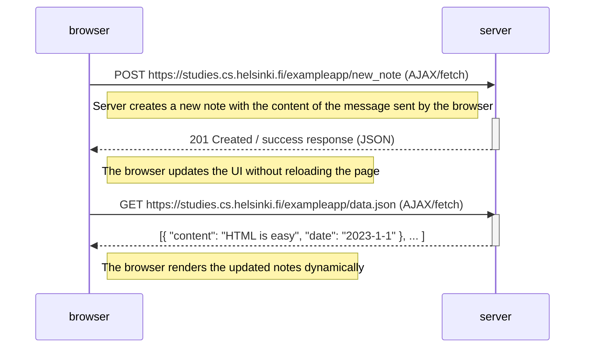

```mermaid
sequenceDiagram
    participant browser
    participant server

    browser->>server: POST https://studies.cs.helsinki.fi/exampleapp/new_note (AJAX/fetch)
    Note left of server: Server creates a new note with the content of the message sent by the browser
    activate server
    server-->>browser: 201 Created / success response (JSON)
    deactivate server

    Note right of browser: The browser updates the UI without reloading the page

    browser->>server: GET https://studies.cs.helsinki.fi/exampleapp/data.json (AJAX/fetch)
    activate server
    server-->>browser: [{ "content": "HTML is easy", "date": "2023-1-1" }, ... ]
    deactivate server

    Note right of browser: The browser renders the updated notes dynamically
```
