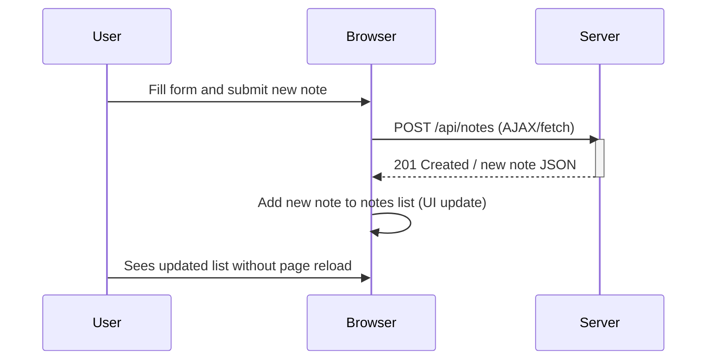

```mermaid
sequenceDiagram
    participant User
    participant Browser
    participant Server

    User->>Browser: Fill form and submit new note
    Browser->>Server: POST /api/notes (AJAX/fetch)
    activate Server
    Server-->>Browser: 201 Created / new note JSON
    deactivate Server
    Browser->>Browser: Add new note to notes list (UI update)
    User->>Browser: Sees updated list without page reload
```
