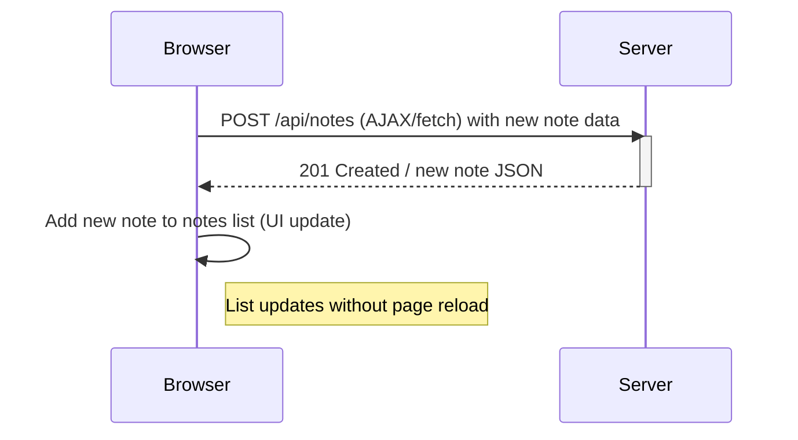

```mermaid
sequenceDiagram
    participant Browser
    participant Server

    Browser->>Server: POST /api/notes (AJAX/fetch) with new note data
    activate Server
    Server-->>Browser: 201 Created / new note JSON
    deactivate Server
    Browser->>Browser: Add new note to notes list (UI update)
    Note right of Browser: List updates without page reload
```
